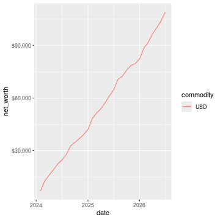
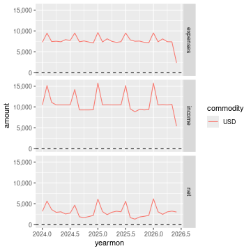

# ledger 

[](https://cran.r-project.org/package=ledger)
[](https://github.com/trevorld/r-ledger/actions)
[](https://app.codecov.io/github/trevorld/r-ledger?branch=master)
[](https://cran.r-project.org/package=ledger)

### Table of Contents

* [Installation](#installation)
* [Examples](#examples)
  - [API](#api)
    - [`register()`](#register)
    - [Using `rio::import()` and `rio::convert()`](#using-rioimport-and-rioconvert)
    - [`net_worth()`](#net_worth)
    - [`prune_coa()`](#prune_coa)
  - [Basic personal accounting reports](#basic-personal-accounting-reports)
    - [Basic balance sheets](#basic-balance-sheets)
    - [Basic net worth chart](#basic-net-worth-chart)
    - [Basic income sheets](#basic-income-sheets)

`ledger` is an R package to import data from [plain text accounting](https://plaintextaccounting.org/) software like [Ledger](https://ledger-cli.org/), [HLedger](https://hledger.org/), and [Beancount](https://github.com/beancount/beancount) into an R data frame for convenient analysis, plotting, and export.

Right now it supports reading in the register from `ledger`, `hledger`, and `beancount` files.


## Installation

To install the last version released to CRAN use the following command in R:

```r
install.packages("ledger")
```

To install the development version of the `ledger` package (and its R package dependencies) use the `install_github` function from the `remotes` package in R:

```r
install.packages("remotes")
remotes::install_github("trevorld/r-ledger")
```

This package also has some system dependencies that need to be installed depending on which plaintext accounting files you wish to read:

* **ledger**: [ledger](https://ledger-cli.org/) (>= 3.1)
* **hledger**: [hledger](https://hledger.org/) (>= 1.4)
* **beancount**: [beanquery](https://github.com/beancount/beanquery) or [rustledger](https://github.com/rustledger/rustledger) (>= 0.15.0)

To install hledger run the following in your shell:

```bash
stack update && stack install --resolver=lts-14.3 hledger-lib-1.15.2 hledger-1.15.2 hledger-web-1.15 hledger-ui-1.15 --verbosity=error
```

To install `bean-query` (to read `beancount` files) run the following in your shell:

```bash
pip3 install beanquery
```

Alternatively, install `rledger` from [rustledger](https://github.com/rustledger/rustledger) (>= 0.15.0).

[Several pre-compiled Ledger binaries are available](https://ledger-cli.org/download.html) (often found in several open source repos).

## Examples

### API

The main function of this package is `register()` which reads in the register of a plaintext accounting file. This package also registers S3 methods so one can use `rio::import()` to read in a register, a `net_worth()` convenience function, and a `prune_coa()` convenience function.

#### `register()`

Here are some examples of very basic files stored within the package:


``` r
library("ledger")
ledger_file <- system.file("extdata", "example.ledger", package = "ledger")
register(ledger_file)
```

```
## # A tibble: 42 × 9
##    date       mark  payee     description code  account amount commodity comment
##    <date>     <chr> <chr>     <chr>       <chr> <chr>    <dbl> <chr>     <chr>  
##  1 2015-12-31 *     <NA>      Opening Ba… <NA>  Assets…  5000  USD       ""     
##  2 2015-12-31 *     <NA>      Opening Ba… <NA>  Equity… -5000  USD       ""     
##  3 2016-01-01 *     Landlord  Rent        <NA>  Assets… -1500  USD       ""     
##  4 2016-01-01 *     Landlord  Rent        <NA>  Expens…  1500  USD       ""     
##  5 2016-01-01 *     Brokerage Buy Stock   <NA>  Assets… -1000  USD       ""     
##  6 2016-01-01 *     Brokerage Buy Stock   <NA>  Equity…  1000  USD       ""     
##  7 2016-01-01 *     Brokerage Buy Stock   <NA>  Assets…     4  SP        ""     
##  8 2016-01-01 *     Brokerage Buy Stock   <NA>  Equity… -1000  USD       ""     
##  9 2016-01-01 *     Supermar… Grocery st… <NA>  Expens…   501. USD       "Link:…
## 10 2016-01-01 *     Supermar… Grocery st… <NA>  Liabil…  -501. USD       "Link:…
## # ℹ 32 more rows
```

``` r
hledger_file <- system.file("extdata", "example.hledger", package = "ledger")
register(hledger_file)
```

```
## # A tibble: 42 × 12
##    date       mark  payee   description account amount commodity historical_cost
##    <date>     <chr> <chr>   <chr>       <chr>    <dbl> <chr>               <dbl>
##  1 2015-12-31 *     <NA>    Opening Ba… Assets…  5000  USD                 5000 
##  2 2015-12-31 *     <NA>    Opening Ba… Equity… -5000  USD                -5000 
##  3 2016-01-01 *     Landlo… Rent        Assets… -1500  USD                -1500 
##  4 2016-01-01 *     Landlo… Rent        Expens…  1500  USD                 1500 
##  5 2016-01-01 *     Broker… Buy Stock   Assets… -1000  USD                -1000 
##  6 2016-01-01 *     Broker… Buy Stock   Equity…  1000  USD                 1000 
##  7 2016-01-01 *     Broker… Buy Stock   Assets…     4  SP                  1000 
##  8 2016-01-01 *     Broker… Buy Stock   Equity… -1000  USD                -1000 
##  9 2016-01-01 *     Superm… Grocery st… Expens…   501. USD                  501.
## 10 2016-01-01 *     Superm… Grocery st… Liabil…  -501. USD                 -501.
## # ℹ 32 more rows
## # ℹ 4 more variables: hc_commodity <chr>, market_value <dbl>,
## #   mv_commodity <chr>, id <chr>
```

``` r
beancount_file <- system.file("extdata", "example.beancount", package = "ledger")
register(beancount_file)
```

```
## # A tibble: 42 × 13
##    date       mark  payee   description account amount commodity historical_cost
##    <date>     <chr> <chr>   <chr>       <chr>    <dbl> <chr>               <dbl>
##  1 2015-12-31 *     ""      Opening Ba… Assets…  5000  USD                 5000 
##  2 2015-12-31 *     ""      Opening Ba… Equity… -5000  USD                -5000 
##  3 2016-01-01 *     "Landl… Rent        Assets… -1500  USD                -1500 
##  4 2016-01-01 *     "Landl… Rent        Expens…  1500  USD                 1500 
##  5 2016-01-01 *     "Broke… Buy Stock   Assets… -1000  USD                -1000 
##  6 2016-01-01 *     "Broke… Buy Stock   Equity…  1000  USD                 1000 
##  7 2016-01-01 *     "Broke… Buy Stock   Assets…     4  SP                  1000 
##  8 2016-01-01 *     "Broke… Buy Stock   Equity… -1000  USD                -1000 
##  9 2016-01-01 *     "Super… Grocery st… Expens…   501. USD                  501.
## 10 2016-01-01 *     "Super… Grocery st… Liabil…  -501. USD                 -501.
## # ℹ 32 more rows
## # ℹ 5 more variables: hc_commodity <chr>, market_value <dbl>,
## #   mv_commodity <chr>, tags <chr>, id <chr>
```

Here is an example reading in a beancount file generated by `bean-example`:


``` r
bean_example_file <- tempfile(fileext = ".beancount")
system(paste("bean-example -o", bean_example_file), ignore.stderr = TRUE)
df <- register(bean_example_file)
print(df)
```

```
## # A tibble: 2,898 × 13
##    date       mark  payee  description account  amount commodity historical_cost
##    <date>     <chr> <chr>  <chr>       <chr>     <dbl> <chr>               <dbl>
##  1 2024-01-01 *     ""     Opening Ba… Assets…   3664. USD                 3664.
##  2 2024-01-01 *     ""     Opening Ba… Equity…  -3664. USD                -3664.
##  3 2024-01-01 *     ""     Allowed co… Income… -18500  IRAUSD            -18500 
##  4 2024-01-01 *     ""     Allowed co… Assets…  18500  IRAUSD             18500 
##  5 2024-01-03 *     "Rive… Paying the… Assets…  -2400  USD                -2400 
##  6 2024-01-03 *     "Rive… Paying the… Expens…   2400  USD                 2400 
##  7 2024-01-04 *     "BANK… Monthly ba… Assets…     -4  USD                   -4 
##  8 2024-01-04 *     "BANK… Monthly ba… Expens…      4  USD                    4 
##  9 2024-01-04 *     "Hool… Payroll     Assets…   1351. USD                 1351.
## 10 2024-01-04 *     "Hool… Payroll     Assets…   1200  USD                 1200 
## # ℹ 2,888 more rows
## # ℹ 5 more variables: hc_commodity <chr>, market_value <dbl>,
## #   mv_commodity <chr>, tags <chr>, id <chr>
```

``` r
suppressPackageStartupMessages(library("dplyr"))
dplyr::filter(df, grepl("Expenses", account), grepl("trip", tags)) %>%
    group_by(trip = tags, account) %>%
    summarize(trip_total = sum(amount), .groups = "drop")
```

```
## # A tibble: 5 × 3
##   trip                    account                  trip_total
##   <chr>                   <chr>                         <dbl>
## 1 trip-chicago-2024       Expenses:Food:Alcohol          67.3
## 2 trip-chicago-2024       Expenses:Food:Coffee           48.4
## 3 trip-chicago-2024       Expenses:Food:Restaurant      483. 
## 4 trip-san-francisco-2025 Expenses:Food:Coffee           24.4
## 5 trip-san-francisco-2025 Expenses:Food:Restaurant      745.
```

#### Using `rio::import()` and `rio::convert()`

If one has loaded in the `ledger` package one can also use `rio::import()` to read in the register:


``` r
df2 <- rio::import(bean_example_file)
all.equal(df, tibble::as_tibble(df2))
```

```
## [1] TRUE
```

The main advantage of this is that it allows one to use `rio::convert` to easily convert plaintext accounting files to several other file formats such as a csv file. Here is a shell example:

```bash
bean-example -o example.beancount
Rscript --default-packages=ledger,rio -e 'convert("example.beancount", "example.csv")'
```

#### `net_worth()`

Some examples of using the `net_worth` function using the example files from the `register` examples:


``` r
dates <- seq(as.Date("2016-01-01"), as.Date("2018-01-01"), by = "years")
net_worth(ledger_file, dates)
```

```
## # A tibble: 3 × 6
##   date       commodity net_worth assets liabilities revalued
##   <date>     <chr>         <dbl>  <dbl>       <dbl>    <dbl>
## 1 2016-01-01 USD           5000    5000          0         0
## 2 2017-01-01 USD           4361.   4882       -521.        0
## 3 2018-01-01 USD           6743.   6264       -521.     1000
```

``` r
net_worth(hledger_file, dates)
```

```
## # A tibble: 3 × 5
##   date       commodity net_worth assets liabilities
##   <date>     <chr>         <dbl>  <dbl>       <dbl>
## 1 2016-01-01 USD           5000    5000          0 
## 2 2017-01-01 USD           4361.   4882       -521.
## 3 2018-01-01 USD           6743.   7264       -521.
```

``` r
net_worth(beancount_file, dates)
```

```
## # A tibble: 3 × 5
##   date       commodity net_worth assets liabilities
##   <date>     <chr>         <dbl>  <dbl>       <dbl>
## 1 2016-01-01 USD           5000    5000          0 
## 2 2017-01-01 USD           4361.   4882       -521.
## 3 2018-01-01 USD           6743.   7264       -521.
```

``` r
dates <- seq(min(as.Date(df$date)), max(as.Date(df$date)), by = "years")
net_worth(bean_example_file, dates)
```

```
## # A tibble: 6 × 5
##   date       commodity net_worth assets liabilities
##   <date>     <chr>         <dbl>  <dbl>       <dbl>
## 1 2025-01-01 IRAUSD           0      0           0 
## 2 2025-01-01 USD          41983. 42888.       -905.
## 3 2025-01-01 VACHR           10     10           0 
## 4 2026-01-01 IRAUSD           0      0           0 
## 5 2026-01-01 USD          79081. 80733.      -1652.
## 6 2026-01-01 VACHR           20     20           0
```

#### `prune_coa()`

Some examples using the `prune_coa` function to simplify the "Chart of Account" names to a given maximum depth:


``` r
suppressPackageStartupMessages(library("dplyr"))
df <- register(bean_example_file) %>% dplyr::filter(!is.na(commodity))
df %>%
    prune_coa() %>%
    group_by(account, mv_commodity) %>%
    summarize(market_value = sum(market_value), .groups = "drop")
```

```
## # A tibble: 11 × 3
##    account     mv_commodity market_value
##    <chr>       <chr>               <dbl>
##  1 Assets      IRAUSD              4100 
##  2 Assets      USD               104595.
##  3 Assets      VACHR                 80 
##  4 Equity      USD                -3664.
##  5 Expenses    IRAUSD             51400 
##  6 Expenses    USD               230242.
##  7 Expenses    VACHR                240 
##  8 Income      IRAUSD            -55500 
##  9 Income      USD              -324422.
## 10 Income      VACHR               -320 
## 11 Liabilities USD                -2127.
```

``` r
df %>%
    prune_coa(2) %>%
    group_by(account, mv_commodity) %>%
    summarize(market_value = sum(market_value), .groups = "drop")
```

```
## # A tibble: 17 × 3
##    account                     mv_commodity market_value
##    <chr>                       <chr>               <dbl>
##  1 Assets:US                   IRAUSD           4.1 e+ 3
##  2 Assets:US                   USD              1.05e+ 5
##  3 Assets:US                   VACHR            8   e+ 1
##  4 Equity:Opening-Balances     USD             -3.66e+ 3
##  5 Expenses:Financial          USD              3.80e+ 2
##  6 Expenses:Food               USD              1.62e+ 4
##  7 Expenses:Health             USD              6.20e+ 3
##  8 Expenses:Home               USD              7.56e+ 4
##  9 Expenses:Taxes              IRAUSD           5.14e+ 4
## 10 Expenses:Taxes              USD              1.28e+ 5
## 11 Expenses:Transport          USD              3.36e+ 3
## 12 Expenses:Vacation           VACHR            2.4 e+ 2
## 13 Income:US                   IRAUSD          -5.55e+ 4
## 14 Income:US                   USD             -3.24e+ 5
## 15 Income:US                   VACHR           -3.2 e+ 2
## 16 Liabilities:AccountsPayable USD              2.84e-14
## 17 Liabilities:US              USD             -2.13e+ 3
```

### Basic personal accounting reports

Here are some examples using the functions in the package to help generate various personal accounting reports of the beancount example generated by `bean-example`.

First we load the (mainly tidyverse) libraries we'll be using and adjust terminal output:


``` r
library("ledger")
library("dplyr")
filter <- dplyr::filter
library("ggplot2")
library("scales")
library("tidyr")
library("zoo")
filename <- tempfile(fileext = ".beancount")
system(paste("bean-example -o", filename), ignore.stderr = TRUE)
df <- register(filename) %>%
    mutate(yearmon = zoo::as.yearmon(date)) %>%
    filter(commodity == "USD")
nw <- net_worth(filename)
```

Then we'll write some convenience functions we'll use over and over again:


``` r
print_tibble_rows <- function(df) {
    print(df, n = nrow(df))
}
count_beans <- function(df, filter_str = "", ...,
                        amount = "amount",
                        commodity = "commodity",
                        cutoff = 1e-3) {
    commodity <- sym(commodity)
    amount_var <- sym(amount)
    filter(df, grepl(filter_str, account)) %>%
        group_by(account, !!commodity, ...) %>%
        summarize(!!amount := sum(!!amount_var), .groups = "drop") %>%
        filter(abs(!!amount_var) > cutoff & !is.na(!!amount_var)) %>%
        arrange(desc(abs(!!amount_var)))
}
```

#### Basic balance sheets

Here are some basic balance sheets (using the market value of our assets):


``` r
print_balance_sheet <- function(df) {
    assets <- count_beans(df, "^Assets",
        amount = "market_value", commodity = "mv_commodity"
    )
    print_tibble_rows(assets)
    liabilities <- count_beans(df, "^Liabilities",
        amount = "market_value", commodity = "mv_commodity"
    )
    print_tibble_rows(liabilities)
}
print(nw)
```

```
## # A tibble: 3 × 5
##   date       commodity net_worth  assets liabilities
##   <date>     <chr>         <dbl>   <dbl>       <dbl>
## 1 2026-06-13 IRAUSD        4100    4100           0 
## 2 2026-06-13 USD         108856. 111667.      -2811.
## 3 2026-06-13 VACHR         -120    -120           0
```

``` r
print_balance_sheet(prune_coa(df, 2))
```

```
## # A tibble: 1 × 3
##   account   mv_commodity market_value
##   <chr>     <chr>               <dbl>
## 1 Assets:US USD                 7265.
## # A tibble: 1 × 3
##   account        mv_commodity market_value
##   <chr>          <chr>               <dbl>
## 1 Liabilities:US USD                -2811.
```

``` r
print_balance_sheet(df)
```

```
## # A tibble: 3 × 3
##   account                 mv_commodity market_value
##   <chr>                   <chr>               <dbl>
## 1 Assets:US:ETrade:Cash   USD              6651.   
## 2 Assets:US:BofA:Checking USD               613.   
## 3 Assets:US:Vanguard:Cash USD                 0.190
## # A tibble: 1 × 3
##   account                    mv_commodity market_value
##   <chr>                      <chr>               <dbl>
## 1 Liabilities:US:Chase:Slate USD                -2811.
```

#### Basic net worth chart

Here is a basic chart of one's net worth from the beginning of the plaintext accounting file to today by month:


``` r
next_month <- function(date) {
    zoo::as.Date(zoo::as.yearmon(date) + 1 / 12)
}
nw_dates <- seq(next_month(min(df$date)), next_month(Sys.Date()), by = "months")
df_nw <- net_worth(filename, nw_dates) %>% filter(commodity == "USD")
ggplot(df_nw, aes(x = date, y = net_worth, colour = commodity, group = commodity)) +
    geom_line() +
    scale_y_continuous(labels = scales::dollar)
```



#### Basic income sheets


``` r
month_cutoff <- zoo::as.yearmon(Sys.Date()) - 2 / 12
compute_income <- function(df) {
    count_beans(df, "^Income", yearmon) %>%
        mutate(income = -amount) %>%
        select(-amount) %>%
        ungroup()
}
print_income <- function(df) {
    compute_income(df) %>%
        filter(yearmon >= month_cutoff) %>%
        spread(yearmon, income, fill = 0) %>%
        print_tibble_rows()
}
compute_expenses <- function(df) {
    count_beans(df, "^Expenses", yearmon) %>%
        mutate(expenses = amount) %>%
        select(-amount) %>%
        ungroup()
}
print_expenses <- function(df) {
    compute_expenses(df) %>%
        filter(yearmon >= month_cutoff) %>%
        spread(yearmon, expenses, fill = 0) %>%
        print_tibble_rows()
}
compute_total <- function(df) {
    full_join(
        compute_income(prune_coa(df)) %>% select(-account),
        compute_expenses(prune_coa(df)) %>% select(-account),
        by = c("yearmon", "commodity")
    ) %>%
        mutate(
            income = ifelse(is.na(income), 0, income),
            expenses = ifelse(is.na(expenses), 0, expenses),
            net = income - expenses
        ) %>%
        gather(type, amount, -yearmon, -commodity)
}
print_total <- function(df) {
    compute_total(df) %>%
        filter(yearmon >= month_cutoff) %>%
        spread(yearmon, amount, fill = 0) %>%
        print_tibble_rows()
}
print_total(df)
```

```
## # A tibble: 3 × 5
##   commodity type     `Apr 2026` `May 2026` `Jun 2026`
##   <chr>     <chr>         <dbl>      <dbl>      <dbl>
## 1 USD       expenses      7428.      7397.      2347.
## 2 USD       income       10479.     10623.      5362.
## 3 USD       net           3051.      3226.      3015.
```

``` r
print_income(prune_coa(df, 2))
```

```
## # A tibble: 1 × 5
##   account   commodity `Apr 2026` `May 2026` `Jun 2026`
##   <chr>     <chr>          <dbl>      <dbl>      <dbl>
## 1 Income:US USD           10479.     10623.      5362.
```

``` r
print_expenses(prune_coa(df, 2))
```

```
## # A tibble: 6 × 5
##   account            commodity `Apr 2026` `May 2026` `Jun 2026`
##   <chr>              <chr>          <dbl>      <dbl>      <dbl>
## 1 Expenses:Financial USD               4        13.0       13.0
## 2 Expenses:Food      USD             516.      492.       245. 
## 3 Expenses:Health    USD             194.      194.        96.9
## 4 Expenses:Home      USD            2610.     2594.         0  
## 5 Expenses:Taxes     USD            3984.     3984.      1992. 
## 6 Expenses:Transport USD             120       120          0
```

``` r
print_income(df)
```

```
## # A tibble: 4 × 5
##   account                         commodity `Apr 2026` `May 2026` `Jun 2026`
##   <chr>                           <chr>          <dbl>      <dbl>      <dbl>
## 1 Income:US:BayBook:GroupTermLife USD             48.6       48.6       24.3
## 2 Income:US:BayBook:Match401k     USD           1200       1200        600  
## 3 Income:US:BayBook:Salary        USD           9231.      9231.      4615. 
## 4 Income:US:ETrade:PnL            USD              0        144        123.
```

``` r
print_expenses(df)
```

```
## # A tibble: 19 × 5
##    account                            commodity `Apr 2026` `May 2026` `Jun 2026`
##    <chr>                              <chr>          <dbl>      <dbl>      <dbl>
##  1 Expenses:Financial:Commissions     USD             0          8.95       8.95
##  2 Expenses:Financial:Fees            USD             4          4          4   
##  3 Expenses:Food:Groceries            USD           160.       206.       181.  
##  4 Expenses:Food:Restaurant           USD           356.       286.        64.4 
##  5 Expenses:Health:Dental:Insurance   USD             5.8        5.8        2.9 
##  6 Expenses:Health:Life:GroupTermLife USD            48.6       48.6       24.3 
##  7 Expenses:Health:Medical:Insurance  USD            54.8       54.8       27.4 
##  8 Expenses:Health:Vision:Insurance   USD            84.6       84.6       42.3 
##  9 Expenses:Home:Electricity          USD            65         65          0   
## 10 Expenses:Home:Internet             USD            79.9       80.1        0   
## 11 Expenses:Home:Phone                USD            65.4       48.7        0   
## 12 Expenses:Home:Rent                 USD          2400       2400          0   
## 13 Expenses:Taxes:Y2026:US:CityNYC    USD           350.       350.       175.  
## 14 Expenses:Taxes:Y2026:US:Federal    USD          2126.      2126.      1063.  
## 15 Expenses:Taxes:Y2026:US:Medicare   USD           213.       213.       107.  
## 16 Expenses:Taxes:Y2026:US:SDI        USD             2.24       2.24       1.12
## 17 Expenses:Taxes:Y2026:US:SocSec     USD           563.       563.       282.  
## 18 Expenses:Taxes:Y2026:US:State      USD           730.       730.       365.  
## 19 Expenses:Transport:Tram            USD           120        120          0
```

And here is a plot of income, expenses, and net income over time:


``` r
ggplot(
    compute_total(df),
    aes(x = yearmon, y = amount, group = commodity, colour = commodity)
) +
    facet_grid(type ~ .) +
    geom_line() +
    geom_hline(yintercept = 0, linetype = "dashed") +
    scale_x_continuous() +
    scale_y_continuous(labels = scales::comma)
```


