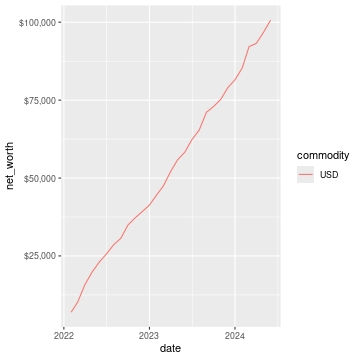
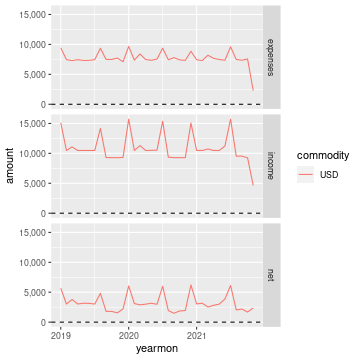

ledger
======

.. image:: https://www.r-pkg.org/badges/version/ledger
    :target: https://cran.r-project.org/package=ledger
    :alt: CRAN Status Badge

.. image:: https://github.com/trevorld/r-ledger/workflows/R-CMD-check/badge.svg
    :target: https://github.com/trevorld/r-ledger/actions
    :alt: R-CMD-check

.. image:: https://img.shields.io/codecov/c/github/trevorld/r-ledger/master.svg
    :target: https://codecov.io/github/trevorld/r-ledger?branch=master
    :alt: Coverage Status

.. image:: https://cranlogs.r-pkg.org/badges/ledger
    :target: https://cran.r-project.org/package=ledger
    :alt: RStudio CRAN mirror downloads

``ledger`` is an R package to import data from `plain text accounting <https://plaintextaccounting.org/>`_ software like `Ledger <https://www.ledger-cli.org/>`_, `HLedger <https://hledger.org/>`_, and `Beancount <https://github.com/beancount/beancount>`_ into an R data frame for convenient analysis, plotting, and export.

Right now it supports reading in the register from ``ledger``, ``hledger``, and ``beancount`` files.  

.. contents::

Installation
------------

To install the last version released to CRAN use the following command in R:

.. code:: r

    install.packages("ledger")

To install the development version of the ``ledger`` package (and its R package dependencies) use the ``install_github`` function from the ``remotes`` package in R:

.. code:: r
    
    install.packages("remotes")
    remotes::install_github("trevorld/r-ledger")

This package also has some system dependencies that need to be installed depending on which plaintext accounting files you wish to read to be able to read in:

ledger
    `ledger <https://www.ledger-cli.org/>`_ (>= 3.1) 

hledger
    `hledger <https://hledger.org/>`_ (>= 1.4)

beancount
    `beancount <https://github.com/beancount/beancount>`_ (>= 2.0)

To install hledger run the following in your shell:

.. code:: bash

    stack update && stack install --resolver=lts-14.3 hledger-lib-1.15.2 hledger-1.15.2 hledger-web-1.15 hledger-ui-1.15 --verbosity=error 

To install beancount run the following in your shell:

.. code:: bash

    pip3 install beancount

`Several pre-compiled Ledger binaries are available <https://www.ledger-cli.org/download.html>`_ (often found in several open source repos).

To run the unit tests you'll also need the suggested R package ``testthat``.

Examples
--------

API
+++

The main function of this package is ``register`` which reads in the register of a plaintext accounting file.  This package also registers S3 methods so one can use ``rio::import`` to read in a register, a ``net_worth`` convenience function, and a ``prune_coa`` convenience function.

register
~~~~~~~~

Here are some examples of very basic files stored within the package:

.. sourcecode:: r
    

    library("ledger")
    options(width=180)
    ledger_file <- system.file("extdata", "example.ledger", package = "ledger") 
    register(ledger_file)

::

    ## # A tibble: 42 × 8
    ##    date       mark  payee       description                     account                    amount commodity comment
    ##    <date>     <chr> <chr>       <chr>                           <chr>                       <dbl> <chr>     <chr>  
    ##  1 2015-12-31 *     <NA>        Opening Balances                Assets:JT-Checking          5000  USD       <NA>   
    ##  2 2015-12-31 *     <NA>        Opening Balances                Equity:Opening             -5000  USD       <NA>   
    ##  3 2016-01-01 *     Landlord    Rent                            Assets:JT-Checking         -1500  USD       <NA>   
    ##  4 2016-01-01 *     Landlord    Rent                            Expenses:Shelter:Rent       1500  USD       <NA>   
    ##  5 2016-01-01 *     Brokerage   Buy Stock                       Assets:JT-Checking         -1000  USD       <NA>   
    ##  6 2016-01-01 *     Brokerage   Buy Stock                       Equity:Transfer             1000  USD       <NA>   
    ##  7 2016-01-01 *     Brokerage   Buy Stock                       Assets:JT-Brokerage            4  SP        <NA>   
    ##  8 2016-01-01 *     Brokerage   Buy Stock                       Equity:Transfer            -1000  USD       <NA>   
    ##  9 2016-01-01 *     Supermarket Grocery store ;; Link: ^grocery Expenses:Food:Grocery        501. USD       <NA>   
    ## 10 2016-01-01 *     Supermarket Grocery store ;; Link: ^grocery Liabilities:JT-Credit-Card  -501. USD       <NA>   
    ## # … with 32 more rows

.. sourcecode:: r
    

    hledger_file <- system.file("extdata", "example.hledger", package = "ledger") 
    register(hledger_file)

::

    ## # A tibble: 42 × 11
    ##    date       mark  payee       description      account                    amount commodity historical_cost hc_commodity market_value mv_commodity
    ##    <date>     <chr> <chr>       <chr>            <chr>                       <dbl> <chr>               <dbl> <chr>               <dbl> <chr>       
    ##  1 2015-12-31 *     <NA>        Opening Balances Assets:JT-Checking          5000  USD                 5000  USD                 5000  USD         
    ##  2 2015-12-31 *     <NA>        Opening Balances Equity:Opening             -5000  USD                -5000  USD                -5000  USD         
    ##  3 2016-01-01 *     Landlord    Rent             Assets:JT-Checking         -1500  USD                -1500  USD                -1500  USD         
    ##  4 2016-01-01 *     Landlord    Rent             Expenses:Shelter:Rent       1500  USD                 1500  USD                 1500  USD         
    ##  5 2016-01-01 *     Brokerage   Buy Stock        Assets:JT-Checking         -1000  USD                -1000  USD                -1000  USD         
    ##  6 2016-01-01 *     Brokerage   Buy Stock        Equity:Transfer             1000  USD                 1000  USD                 1000  USD         
    ##  7 2016-01-01 *     Brokerage   Buy Stock        Assets:JT-Brokerage            4  SP                  1000  USD                 2000  USD         
    ##  8 2016-01-01 *     Brokerage   Buy Stock        Equity:Transfer            -1000  USD                -1000  USD                -1000  USD         
    ##  9 2016-01-01 *     Supermarket Grocery store    Expenses:Food:Grocery        501. USD                  501. USD                  501. USD         
    ## 10 2016-01-01 *     Supermarket Grocery store    Liabilities:JT-Credit-Card  -501. USD                 -501. USD                 -501. USD         
    ## # … with 32 more rows

.. sourcecode:: r
    

    beancount_file <- system.file("extdata", "example.beancount", package = "ledger") 
    register(beancount_file)

::

    ## # A tibble: 42 × 12
    ##    date       mark  payee         description      account                    amount commodity historical_cost hc_commodity market_value mv_commodity tags 
    ##    <chr>      <chr> <chr>         <chr>            <chr>                       <dbl> <chr>               <dbl> <chr>               <dbl> <chr>        <chr>
    ##  1 2015-12-31 *     ""            Opening Balances Assets:JT-Checking          5000  USD                 5000  USD                 5000  USD          ""   
    ##  2 2015-12-31 *     ""            Opening Balances Equity:Opening             -5000  USD                -5000  USD                -5000  USD          ""   
    ##  3 2016-01-01 *     "Landlord"    Rent             Assets:JT-Checking         -1500  USD                -1500  USD                -1500  USD          ""   
    ##  4 2016-01-01 *     "Landlord"    Rent             Expenses:Shelter:Rent       1500  USD                 1500  USD                 1500  USD          ""   
    ##  5 2016-01-01 *     "Brokerage"   Buy Stock        Assets:JT-Checking         -1000  USD                -1000  USD                -1000  USD          ""   
    ##  6 2016-01-01 *     "Brokerage"   Buy Stock        Equity:Transfer             1000  USD                 1000  USD                 1000  USD          ""   
    ##  7 2016-01-01 *     "Brokerage"   Buy Stock        Assets:JT-Brokerage            4  SP                  1000  USD                 2000  USD          ""   
    ##  8 2016-01-01 *     "Brokerage"   Buy Stock        Equity:Transfer            -1000  USD                -1000  USD                -1000  USD          ""   
    ##  9 2016-01-01 *     "Supermarket" Grocery store    Expenses:Food:Grocery        501. USD                  501. USD                  501. USD          ""   
    ## 10 2016-01-01 *     "Supermarket" Grocery store    Liabilities:JT-Credit-Card  -501. USD                 -501. USD                 -501. USD          ""   
    ## # … with 32 more rows

Here is an example reading in a beancount file generated by ``bean-example``:

.. sourcecode:: r
    

    bean_example_file <- tempfile(fileext = ".beancount")
    system(paste("bean-example -o", bean_example_file), ignore.stderr=TRUE)
    df <- register(bean_example_file)
    options(width=240)
    print(df)

::

    ## # A tibble: 3,330 × 12
    ##    date       mark  payee   description                          account                              amount commodity historical_cost hc_commodity market_value mv_commodity tags 
    ##    <chr>      <chr> <chr>   <chr>                                <chr>                                 <dbl> <chr>               <dbl> <chr>               <dbl> <chr>        <chr>
    ##  1 2019-01-01 *     ""      Opening Balance for checking account Assets:US:BofA:Checking              4119.  USD                4119.  USD                4119.  USD          ""   
    ##  2 2019-01-01 *     ""      Opening Balance for checking account Equity:Opening-Balances             -4119.  USD               -4119.  USD               -4119.  USD          ""   
    ##  3 2019-01-01 *     ""      Allowed contributions for one year   Income:US:Federal:PreTax401k       -18500   IRAUSD           -18500   IRAUSD           -18500   IRAUSD       ""   
    ##  4 2019-01-01 *     ""      Allowed contributions for one year   Assets:US:Federal:PreTax401k        18500   IRAUSD            18500   IRAUSD            18500   IRAUSD       ""   
    ##  5 2019-01-03 *     "Hooli" Payroll                              Assets:US:BofA:Checking              1351.  USD                1351.  USD                1351.  USD          ""   
    ##  6 2019-01-03 *     "Hooli" Payroll                              Assets:US:Vanguard:Cash              1200   USD                1200   USD                1200   USD          ""   
    ##  7 2019-01-03 *     "Hooli" Payroll                              Income:US:Hooli:Salary              -4615.  USD               -4615.  USD               -4615.  USD          ""   
    ##  8 2019-01-03 *     "Hooli" Payroll                              Income:US:Hooli:GroupTermLife         -24.3 USD                 -24.3 USD                 -24.3 USD          ""   
    ##  9 2019-01-03 *     "Hooli" Payroll                              Expenses:Health:Life:GroupTermLife     24.3 USD                  24.3 USD                  24.3 USD          ""   
    ## 10 2019-01-03 *     "Hooli" Payroll                              Expenses:Health:Dental:Insurance        2.9 USD                   2.9 USD                   2.9 USD          ""   
    ## # … with 3,320 more rows

.. sourcecode:: r
    

    suppressPackageStartupMessages(library("dplyr"))
    dplyr::filter(df, grepl("Expenses", account), grepl("trip", tags)) %>% 
        group_by(trip = tags, account) %>% 
        summarise(trip_total = sum(amount))

::

    ## `summarise()` has grouped output by 'trip'. You can override using the `.groups` argument.

::

    ## # A tibble: 7 × 3
    ## # Groups:   trip [3]
    ##   trip                    account                  trip_total
    ##   <chr>                   <chr>                         <dbl>
    ## 1 trip-boston-2020        Expenses:Food:Coffee           6.39
    ## 2 trip-boston-2020        Expenses:Food:Restaurant     234.  
    ## 3 trip-los-angeles-2021   Expenses:Food:Alcohol         52.6 
    ## 4 trip-los-angeles-2021   Expenses:Food:Coffee          24.3 
    ## 5 trip-los-angeles-2021   Expenses:Food:Restaurant     458.  
    ## 6 trip-san-francisco-2019 Expenses:Food:Coffee          30.0 
    ## 7 trip-san-francisco-2019 Expenses:Food:Restaurant     624.

Using rio::import and rio::convert
~~~~~~~~~~~~~~~~~~~~~~~~~~~~~~~~~~

If one has loaded in the ``ledger`` package one can also use ``rio::import`` to read in the register:

.. sourcecode:: r
    

    df2 <- rio::import(bean_example_file)
    all.equal(df, tibble::as_tibble(df2))

::

    ## [1] TRUE

The main advantage of this is that it allows one to use ``rio::convert`` to easily convert plaintext accounting files to several other file formats such as a csv file.  Here is a shell example:

.. code:: bash

    bean-example -o example.beancount
    Rscript --default-packages=ledger,rio -e 'convert("example.beancount", "example.csv")'

net_worth
~~~~~~~~~

Some examples of using the ``net_worth`` function using the example files from the ``register`` examples:

.. sourcecode:: r
    

    dates <- seq(as.Date("2016-01-01"), as.Date("2018-01-01"), by="years")
    net_worth(ledger_file, dates)

::

    ## # A tibble: 3 × 6
    ##   date       commodity net_worth assets liabilities revalued
    ##   <date>     <chr>         <dbl>  <dbl>       <dbl>    <dbl>
    ## 1 2016-01-01 USD           5000    5000          0         0
    ## 2 2017-01-01 USD           4361.   4882       -521.        0
    ## 3 2018-01-01 USD           6743.   6264       -521.     1000

.. sourcecode:: r
    

    net_worth(hledger_file, dates)

::

    ## # A tibble: 3 × 5
    ##   date       commodity net_worth assets liabilities
    ##   <date>     <chr>         <dbl>  <dbl>       <dbl>
    ## 1 2016-01-01 USD           5000    5000          0 
    ## 2 2017-01-01 USD           4361.   4882       -521.
    ## 3 2018-01-01 USD           6743.   7264       -521.

.. sourcecode:: r
    

    net_worth(beancount_file, dates)

::

    ## # A tibble: 3 × 5
    ##   date       commodity net_worth assets liabilities
    ##   <date>     <chr>         <dbl>  <dbl>       <dbl>
    ## 1 2016-01-01 USD           5000    5000          0 
    ## 2 2017-01-01 USD           4361.   4882       -521.
    ## 3 2018-01-01 USD           6743.   7264       -521.

.. sourcecode:: r
    

    net_worth(bean_example_file, dates)

::

    ## # A tibble: 0 × 3
    ## # … with 3 variables: date <date>, commodity <chr>, net_worth <lgl>

prune_coa
~~~~~~~~~

Some examples using the ``prune_coa`` function to simplify the "Chart of Account" names to a given maximum depth:

.. sourcecode:: r
    

    suppressPackageStartupMessages(library("dplyr"))
    df <- register(bean_example_file) %>% dplyr::filter(!is.na(commodity))
    df %>% prune_coa() %>% 
        group_by(account, mv_commodity) %>% 
        summarize(market_value = sum(market_value), .groups = "drop")

::

    ## # A tibble: 11 × 3
    ##    account     mv_commodity market_value
    ##    <chr>       <chr>               <dbl>
    ##  1 Assets      IRAUSD                 0 
    ##  2 Assets      USD               119287.
    ##  3 Assets      VACHR                 87 
    ##  4 Equity      USD                -4119.
    ##  5 Expenses    IRAUSD             55500 
    ##  6 Expenses    USD               269081.
    ##  7 Expenses    VACHR                288 
    ##  8 Income      IRAUSD            -55500 
    ##  9 Income      USD              -377046.
    ## 10 Income      VACHR               -375 
    ## 11 Liabilities USD                -2248.

.. sourcecode:: r
    

    df %>% prune_coa(2) %>% 
        group_by(account, mv_commodity) %>%
        summarize(market_value = sum(market_value), .groups = "drop")

::

    ## # A tibble: 17 × 3
    ##    account                     mv_commodity market_value
    ##    <chr>                       <chr>               <dbl>
    ##  1 Assets:US                   IRAUSD           0       
    ##  2 Assets:US                   USD              1.19e+ 5
    ##  3 Assets:US                   VACHR            8.7 e+ 1
    ##  4 Equity:Opening-Balances     USD             -4.12e+ 3
    ##  5 Expenses:Financial          USD              4.44e+ 2
    ##  6 Expenses:Food               USD              1.87e+ 4
    ##  7 Expenses:Health             USD              7.27e+ 3
    ##  8 Expenses:Home               USD              8.86e+ 4
    ##  9 Expenses:Taxes              IRAUSD           5.55e+ 4
    ## 10 Expenses:Taxes              USD              1.50e+ 5
    ## 11 Expenses:Transport          USD              4.08e+ 3
    ## 12 Expenses:Vacation           VACHR            2.88e+ 2
    ## 13 Income:US                   IRAUSD          -5.55e+ 4
    ## 14 Income:US                   USD             -3.77e+ 5
    ## 15 Income:US                   VACHR           -3.75e+ 2
    ## 16 Liabilities:AccountsPayable USD              5.68e-14
    ## 17 Liabilities:US              USD             -2.25e+ 3

    
Basic personal accounting reports
+++++++++++++++++++++++++++++++++

Here is some examples using the functions in the package to help generate
various personal accounting reports of the 
beancount example generated by ``bean-example``.

First we load the (mainly tidyverse) libraries we'll be using and adjusting terminal output:

.. sourcecode:: r
    

    options(width=240) # tibble output looks better in wide terminal output
    library("ledger")
    library("dplyr")
    filter <- dplyr::filter
    library("ggplot2")
    library("scales")
    library("tidyr")
    library("zoo")
    filename <- tempfile(fileext = ".beancount")
    system(paste("bean-example -o", filename), ignore.stderr=TRUE)
    df <- register(filename) %>% mutate(yearmon = zoo::as.yearmon(date)) %>%
          filter(commodity=="USD")
    nw <- net_worth(filename)

Then we'll write some convenience functions we'll use over and over again:

.. sourcecode:: r
    

    print_tibble_rows <- function(df) {
        print(df, n=nrow(df))
    }
    count_beans <- function(df, filter_str = "", ..., 
                            amount = "amount",
                            commodity="commodity", 
                            cutoff=1e-3) {
        commodity <- sym(commodity)
        amount_var <- sym(amount)
        filter(df, grepl(filter_str, account)) %>% 
            group_by(account, !!commodity, ...) %>%
            summarize(!!amount := sum(!!amount_var), .groups = "drop") %>% 
            filter(abs(!!amount_var) > cutoff & !is.na(!!amount_var)) %>%
            arrange(desc(abs(!!amount_var)))
    }

    
Basic balance sheets
~~~~~~~~~~~~~~~~~~~~

Here is some basic balance sheets (using the market value of our assets):

.. sourcecode:: r
    

    print_balance_sheet <- function(df) {
        assets <- count_beans(df, "^Assets", 
                     amount="market_value", commodity="mv_commodity")
        print_tibble_rows(assets)
        liabilities <- count_beans(df, "^Liabilities", 
                           amount="market_value", commodity="mv_commodity")
        print_tibble_rows(liabilities)
    }
    print(nw)

::

    ## # A tibble: 3 × 5
    ##   date       commodity net_worth  assets liabilities
    ##   <date>     <chr>         <dbl>   <dbl>       <dbl>
    ## 1 2021-11-12 IRAUSD           0       0           0 
    ## 2 2021-11-12 USD         123655. 126076.      -2421.
    ## 3 2021-11-12 VACHR           15      15           0

.. sourcecode:: r
    

    print_balance_sheet(prune_coa(df, 2))

::

    ## # A tibble: 1 × 3
    ##   account   mv_commodity market_value
    ##   <chr>     <chr>               <dbl>
    ## 1 Assets:US USD                 6785.
    ## # A tibble: 1 × 3
    ##   account        mv_commodity market_value
    ##   <chr>          <chr>               <dbl>
    ## 1 Liabilities:US USD                -2421.

.. sourcecode:: r
    

    print_balance_sheet(df)

::

    ## # A tibble: 3 × 3
    ##   account                 mv_commodity market_value
    ##   <chr>                   <chr>               <dbl>
    ## 1 Assets:US:ETrade:Cash   USD             6297.    
    ## 2 Assets:US:BofA:Checking USD              489.    
    ## 3 Assets:US:Vanguard:Cash USD               -0.0200
    ## # A tibble: 1 × 3
    ##   account                    mv_commodity market_value
    ##   <chr>                      <chr>               <dbl>
    ## 1 Liabilities:US:Chase:Slate USD                -2421.

Basic net worth chart
~~~~~~~~~~~~~~~~~~~~~

Here is a basic chart of one's net worth from the beginning of the plaintext accounting file to today by month:

.. sourcecode:: r
    

    next_month <- function(date) {
        zoo::as.Date(zoo::as.yearmon(date) + 1/12)
    }
    nw_dates <- seq(next_month(min(df$date)), next_month(Sys.Date()), by="months")
    df_nw <- net_worth(filename, nw_dates) %>% filter(commodity=="USD")
    ggplot(df_nw, aes(x=date, y=net_worth, colour=commodity, group=commodity)) + 
      geom_line() + scale_y_continuous(labels=scales::dollar)

    Basic net worth chart

Basic income sheets
~~~~~~~~~~~~~~~~~~~

.. sourcecode:: r
    

    month_cutoff <- zoo::as.yearmon(Sys.Date()) - 2/12
    compute_income <- function(df) {
        count_beans(df, "^Income", yearmon) %>% 
            mutate(income = -amount) %>%
            select(-amount) %>% ungroup()
    }
    print_income <- function(df) {
        compute_income(df) %>% 
            filter(yearmon >= month_cutoff) %>%
            spread(yearmon, income, fill=0) %>%
            print_tibble_rows()
    }
    compute_expenses <- function(df) {
        count_beans(df, "^Expenses", yearmon) %>% 
            mutate(expenses = amount) %>%
            select(-amount) %>% ungroup()
    }
    print_expenses <- function(df) {
        compute_expenses(df) %>%
            filter(yearmon >= month_cutoff) %>%
            spread(yearmon, expenses, fill=0) %>%
            print_tibble_rows()
    }
    compute_total <- function(df) {
    full_join(compute_income(prune_coa(df)) %>% select(-account),
              compute_expenses(prune_coa(df)) %>% select(-account), 
              by=c("yearmon", "commodity")) %>%
        mutate(income = ifelse(is.na(income), 0, income),
               expenses = ifelse(is.na(expenses), 0, expenses),
               net = income - expenses) %>%
        gather(type, amount, -yearmon, -commodity)
    }
    print_total <- function(df) {
        compute_total(df) %>%
            filter(yearmon >= month_cutoff) %>%
            spread(yearmon, amount, fill=0) %>%
            print_tibble_rows()
    }
    print_total(df)

::

    ## # A tibble: 3 × 5
    ##   commodity type     `Sep 2021` `Oct 2021` `Nov 2021`
    ##   <chr>     <chr>         <dbl>      <dbl>      <dbl>
    ## 1 USD       expenses      7408.      7453.      2227.
    ## 2 USD       income        9437.      9279.      4640.
    ## 3 USD       net           2028.      1826.      2413.

.. sourcecode:: r
    

    print_income(prune_coa(df, 2))

::

    ## # A tibble: 1 × 5
    ##   account   commodity `Sep 2021` `Oct 2021` `Nov 2021`
    ##   <chr>     <chr>          <dbl>      <dbl>      <dbl>
    ## 1 Income:US USD            9437.      9279.      4640.

.. sourcecode:: r
    

    print_expenses(prune_coa(df, 2))

::

    ## # A tibble: 6 × 5
    ##   account            commodity `Sep 2021` `Oct 2021` `Nov 2021`
    ##   <chr>              <chr>          <dbl>      <dbl>      <dbl>
    ## 1 Expenses:Financial USD               4        39.8        4  
    ## 2 Expenses:Food      USD             504.      502.       134. 
    ## 3 Expenses:Health    USD             194.      194.        96.9
    ## 4 Expenses:Home      USD            2602.     2614.         0  
    ## 5 Expenses:Taxes     USD            3984.     3984.      1992. 
    ## 6 Expenses:Transport USD             120       120          0

.. sourcecode:: r
    

    print_income(df)

::

    ## # A tibble: 3 × 5
    ##   account                        commodity `Sep 2021` `Oct 2021` `Nov 2021`
    ##   <chr>                          <chr>          <dbl>      <dbl>      <dbl>
    ## 1 Income:US:ETrade:GLD:Dividend  USD            157.         0          0  
    ## 2 Income:US:Hoogle:GroupTermLife USD             48.6       48.6       24.3
    ## 3 Income:US:Hoogle:Salary        USD           9231.      9231.      4615.

.. sourcecode:: r
    

    print_expenses(df)

::

    ## # A tibble: 19 × 5
    ##    account                            commodity `Sep 2021` `Oct 2021` `Nov 2021`
    ##    <chr>                              <chr>          <dbl>      <dbl>      <dbl>
    ##  1 Expenses:Financial:Commissions     USD             0         35.8        0   
    ##  2 Expenses:Financial:Fees            USD             4          4          4   
    ##  3 Expenses:Food:Groceries            USD           249.       230.        68.5 
    ##  4 Expenses:Food:Restaurant           USD           256.       272.        65.2 
    ##  5 Expenses:Health:Dental:Insurance   USD             5.8        5.8        2.9 
    ##  6 Expenses:Health:Life:GroupTermLife USD            48.6       48.6       24.3 
    ##  7 Expenses:Health:Medical:Insurance  USD            54.8       54.8       27.4 
    ##  8 Expenses:Health:Vision:Insurance   USD            84.6       84.6       42.3 
    ##  9 Expenses:Home:Electricity          USD            65         65          0   
    ## 10 Expenses:Home:Internet             USD            80.0       79.9        0   
    ## 11 Expenses:Home:Phone                USD            56.8       68.6        0   
    ## 12 Expenses:Home:Rent                 USD          2400       2400          0   
    ## 13 Expenses:Taxes:Y2021:US:CityNYC    USD           350.       350.       175.  
    ## 14 Expenses:Taxes:Y2021:US:Federal    USD          2126.      2126.      1063.  
    ## 15 Expenses:Taxes:Y2021:US:Medicare   USD           213.       213.       107.  
    ## 16 Expenses:Taxes:Y2021:US:SDI        USD             2.24       2.24       1.12
    ## 17 Expenses:Taxes:Y2021:US:SocSec     USD           563.       563.       282.  
    ## 18 Expenses:Taxes:Y2021:US:State      USD           730.       730.       365.  
    ## 19 Expenses:Transport:Tram            USD           120        120          0

And here is a plot of income, expenses, and net income over time:

.. sourcecode:: r
    

    ggplot(compute_total(df), aes(x=yearmon, y=amount, group=commodity, colour=commodity)) +
      facet_grid(type ~ .) +
      geom_line() + geom_hline(yintercept=0, linetype="dashed") +
      scale_x_continuous() + scale_y_continuous(labels=scales::comma) 

    Monthly income chart
